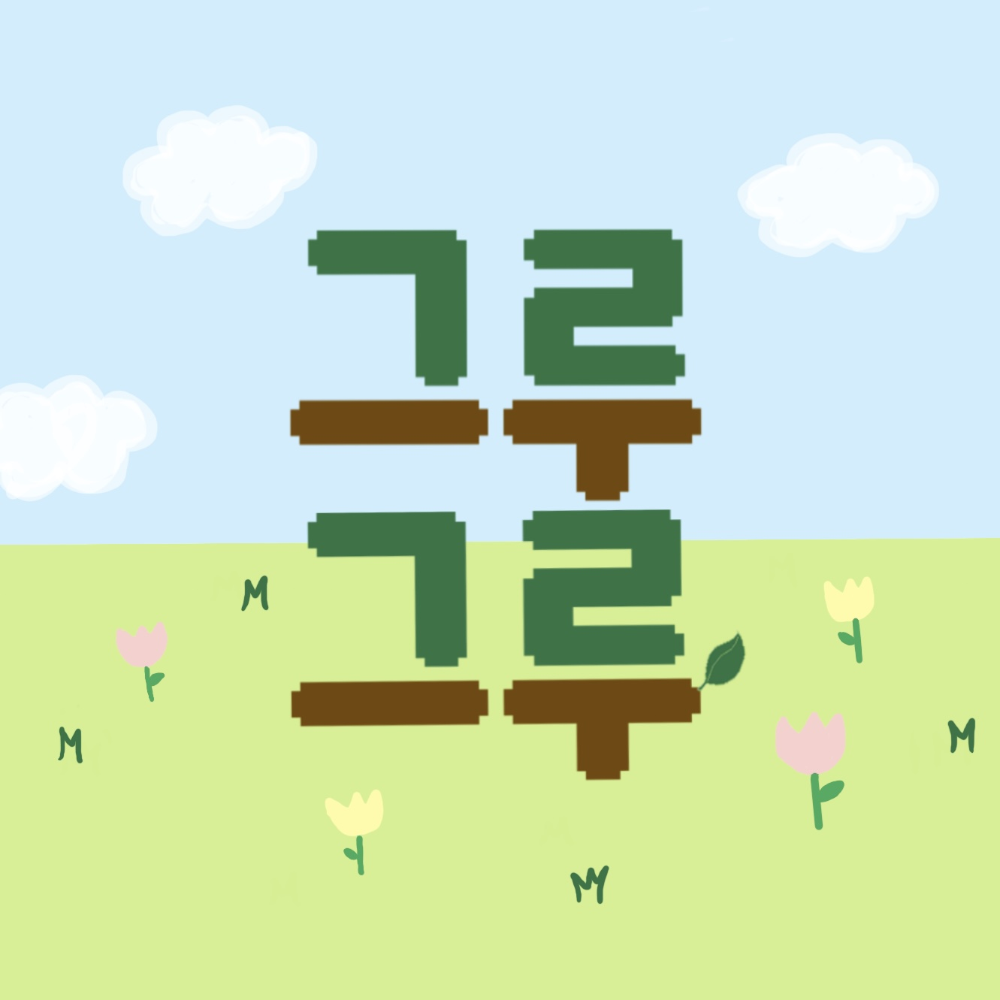
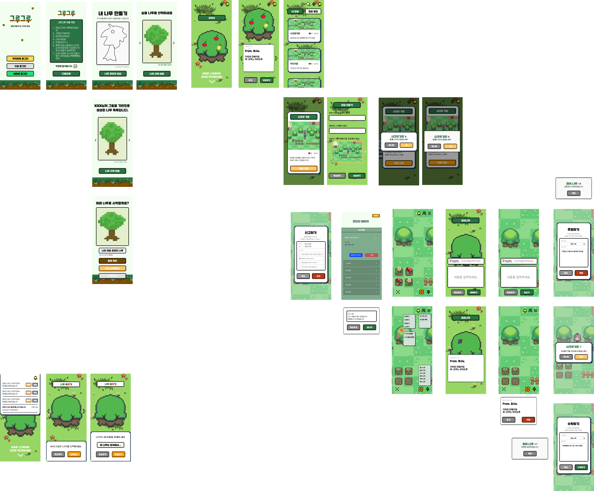
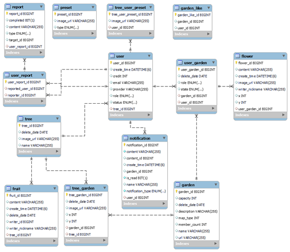
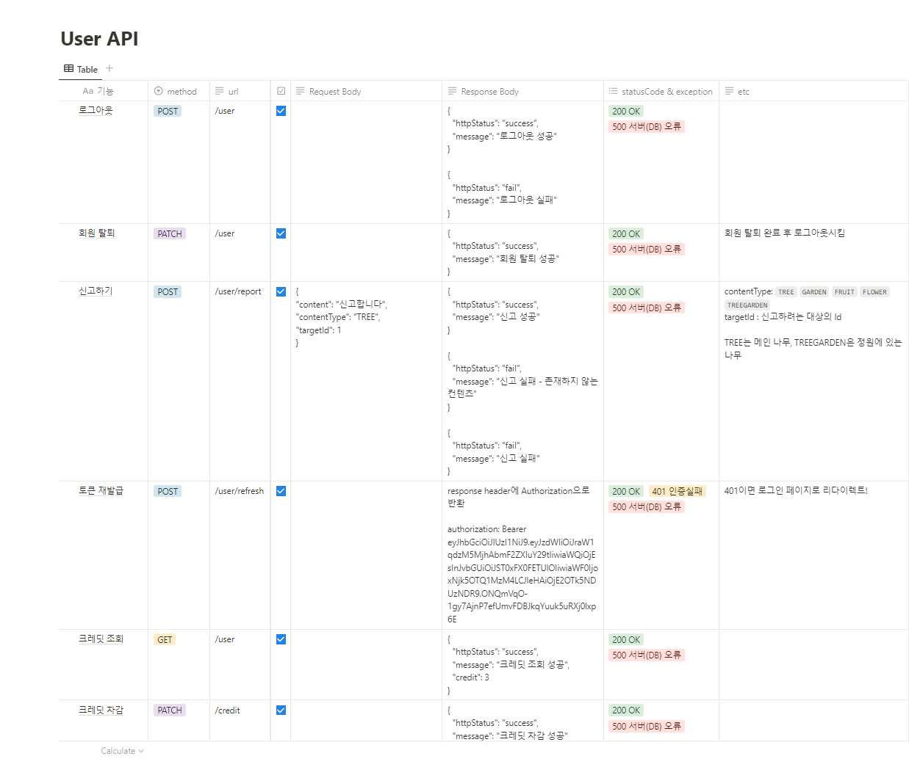
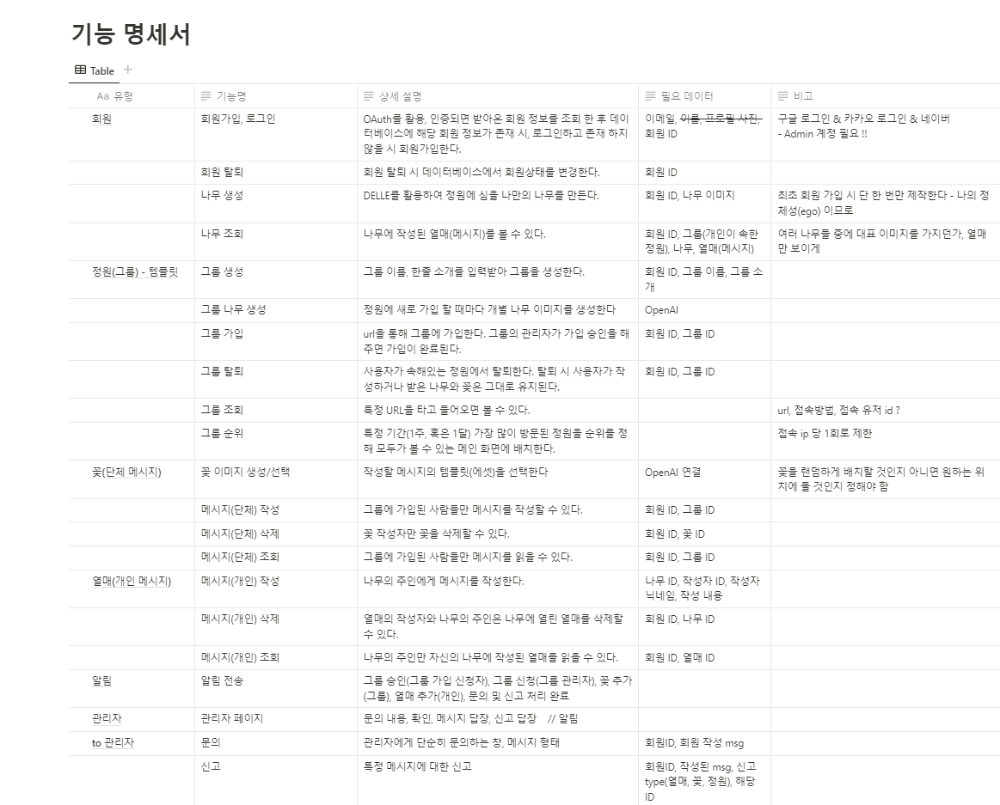
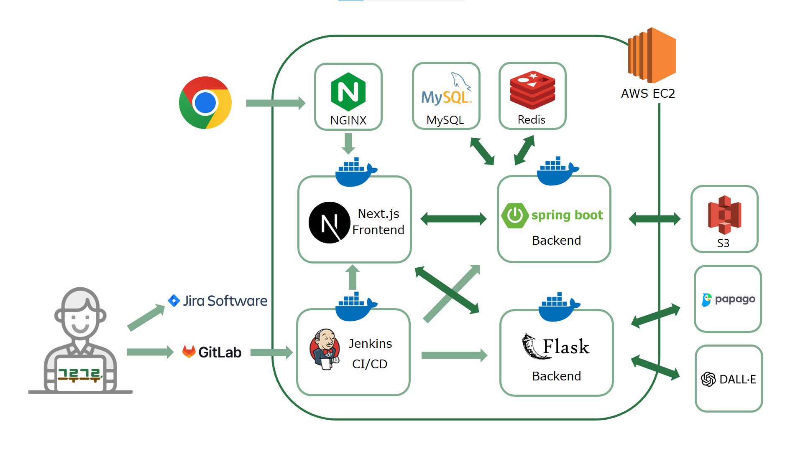

# 🌳그루그루: 우리가 만들어 가는 정원🌳

    

## 📅 프로젝트 개요

🌼 **개발 기간** : 2023.10.12 ~ 2023.11.17 (총 6주)

🌼 **팀원 소개**
|  |  |  ||  |  |
| :----------------------------------------: | :----------------------------------------: | :-----------------------------------------: | :----------------------------------------: | :----------------------------------------: | :----------------------------------------: |
| [👑 문요환](https://github.com/ansdy9600) | [정재웅](https://github.com/chachapapa) | [김한나](https://github.com/Manna-na) | [최규헌](https://github.com/KUMA93) | [김지원](https://github.com/iamjione) | [김민재](https://github.com/GGamangCoder) |
| FE(팀장) | FE | FE, BE | BE | BE | AI, CI/CD |

🌼 **기획 배경(목적)**

- 자율 프로젝트는 3번의 프로젝트 중 마지막이면서, 2학기뿐만 아니라 싸피(SSAFY) 1년 과정의 마지막이기도 합니다. 스스로를 돌아보고, 함께 했던 동료들에게도 인사말과 함께 서로를 추억했으면 좋겠다는 생각을 했습니다. 일반적인 서비스처럼 특정 개인에게만 메시지를 남기는 것이 아니라 그룹을 만들어 소속감을 이어 나갈 수 있게 했습니다. 그리고 각각의 메시지는 하나의 컨텐츠(이미지 – 꽃, 열매)가 되고 함께 만들어 나가는, 또 꾸며가는 또 하나의 컨텐츠(정원)가 됩니다.  
  기획 의도와 함께 서버 단위 렌더링과 ERD 등 그간 배웠던 기술들을 망라할 수 있도록 개발 사이즈(기술 스택)를 정하기도 했습니다.

🌼 **핵심 기능**

- 나무 생성(캔버스 or 생성형 AI 中 택1)
- 개인(나무)에게 익명의 메시지 작성
- 그룹(정원) 전체에게 익명의 메시지 작성
- 메시지 요소(꽃, 나무)를 이용한 정원 직접 꾸미기 가능
- 정원별 좋아요 갯수로 랭킹 조회

 

## 🌻 서비스 소개

###  _그루그루: 우리가 만드는 정원_

> 💝 센스 있는 손으로 정원을 가꾸며 따뜻한 마음을 나누는 온라인 롤링페이퍼 그룹 서비스

**우리 같이 정원을 가꿔볼래?** \
**정원을 가꾸며 나누는 우리의 이야기  그루그루🌳**

 

## ⚙️ 기술 스택

<h4>💻 FRONTEND</h4>

 

<h4>💻 BACKEND</h4>

 

<h4>🌐 CI/CD</h4>

 

<h4>🗄 DB</h4>

 

## 📝 포팅 메뉴얼
### [바로가기](./exec/포팅메뉴얼.md)

 

## ⚙️ 개발 과정

- git flow 를 전적으로 따랐으며 rebase를 적극 활용하는 시도를 했다. (~~물론 개발이 촉박해져서는 대부분 merge-request로 했지만~~)

 

## 🎨 와이어프레임

 

## 🗂️ ERD

 

## 🗒️ 명세서

**[API 명세서](https://separate-bandicoot-57f.notion.site/API-b66646f8703c4030b0e8c2e337862bf8?pvs=4)**

**[기능 명세서](https://separate-bandicoot-57f.notion.site/c9390d228dc94899b378edec4a123ae3?v=8ceaf6054f0c444f8105833346d55eb0&pvs=4)**

 

## 📂 아키텍쳐

 

## 😊 서비스 화면

### [회원 가입]

### [나무 생성]

### [정원 목록 확인]

### [정원 조회]

### [나무/꽃 심기]

### [열매 달기, 꽃 작성]

### [관리자 화면]

  

## 프로젝트 버전 관리

- ver1.0.0

  - 최초 배포
  - 이미지 생성 및 저장 가능
  - 정원 생성 및 가입, 초대(공유)
  - 실시간 알림 서비스

- ver1.1.0(예정)
  - 맵 템플릿 추가 및 변경 가능
  - 정원 내 접속 인원들 간 채팅 기능
